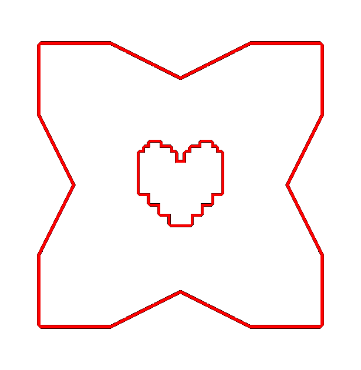

  

# 
FlxDeltarune

**
Just a Deltarune framework made in HaxeFlixel.
**
[
DELTARUNE by Toby Fox
](https://deltarune.com/)

> **ℹ️ NOTICE**
> This framework is still in heavy development. It is **not recommended** for modding yet.

---

## Contents

* [About](#about)
* [Progress](#progress)
* [Build & Run](#build--run)
* [Contributing](#contributing)
* [Wiki](#wiki)

---

## About

FlxDeltarune is a small project that reimagines Deltarune's systems inside HaxeFlixel with a neat modding system. For now, there isn't much to do around but backend is the thing being heavily worked on as of right now.

---

### Progress

#### Engine / Tools
- [x] Tilemap editor
- [ ] Cool map editor
- [ ] Cutscene editor
- [ ] Save system per-mod
- [ ] Documentation and more examples
- [ ] Release builds

#### Battle System
- [ ] Basic battle system
- [ ] ACT commands support
- [ ] Mercy system (spare / pacify)
- [ ] Bullet board attacks with patterns, maybe some helpers for it
- [ ] Party member abilities
- [ ] TP gauge + spell system where it wastes (W.I.P)

#### Overworld
- [ ] Shops with inventory/currency
- [X] Party following system
- [ ] Collisions
- [ ] Load map using the new map system

#### Presentation
- [ ] UI (menus, HUD)
- [ ] Text box effects (wavy, shaking, colors) (W.I.P, thanks zero-flixel!)
- [ ] Dialogue boxes & portraits.

#### Atmosphere & Extras
- [ ] Music layering system
- [ ] Save point menu + healing
- [ ] Fancy transitions (literally just the fade out lol)

---

## Build & Run

TODO!

---

## Contributing

You're welcome to open issues or PRs. Small, focused PRs are easiest to review — bugfix, one feature, or documentation updates at a time.
What I truly mean is, any help is welcome with wide arms.

---

## Wiki

Todo...

# 
 Made with 💖 

